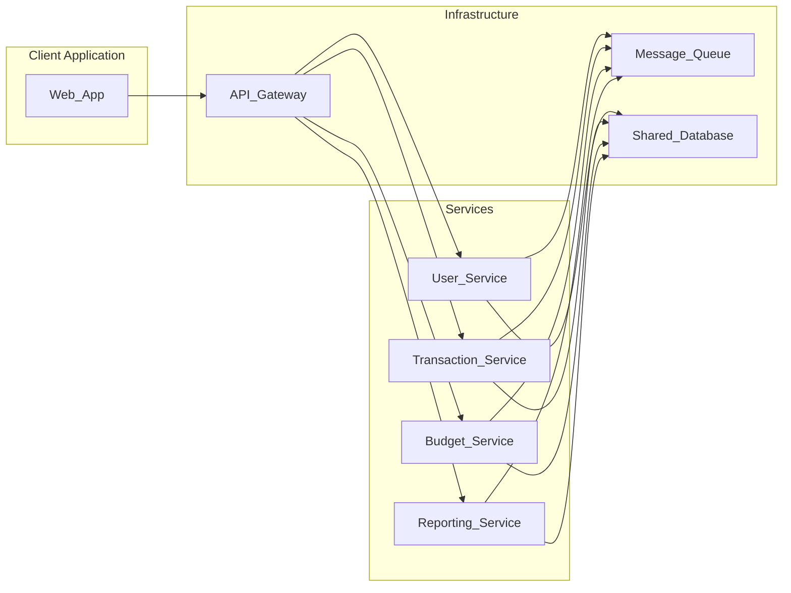

# Final Summary

# Final Project Summary

## Overview

The project consists of a web application that allows users to manage their personal finances. The application is built using a microservices architecture, with several independent services communicating with each other through a message queue and a shared database.

The key components of the project are:

1. **User Service**: Responsible for managing user accounts and authentication.
2. **Transaction Service**: Handles the creation, retrieval, and management of financial transactions.
3. **Budget Service**: Allows users to create and manage their budgets.
4. **Reporting Service**: Generates reports and visualisations based on the user's financial data.
5. **API Gateway**: Provides a unified entry point for the client application to interact with the various services.
6. **Message Queue**: Facilitates asynchronous communication between the services.
7. **Shared Database**: Stores all the application data, including user accounts, transactions, and budgets.

## Detailed Diagram

## Service Descriptions

1. **User Service**:
   - Responsible for managing user accounts and authentication.
   - Provides endpoints for user registration, login, and profile management.
   - Stores user data (e.g., username, email, password) in the shared database.
   - Communicates with other services through the message queue for user-related events.

2. **Transaction Service**:
   - Handles the creation, retrieval, and management of financial transactions.
   - Provides endpoints for users to record their income and expenses.
   - Stores transaction data (e.g., amount, date, category) in the shared database.
   - Communicates with other services through the message queue for transaction-related events.

3. **Budget Service**:
   - Allows users to create and manage their budgets.
   - Provides endpoints for users to set up budget categories and spending limits.
   - Stores budget data (e.g., category, limit, actual spending) in the shared database.
   - Communicates with other services through the message queue for budget-related events.

4. **Reporting Service**:
   - Generates reports and visualisations based on the user's financial data.
   - Provides endpoints for users to view their spending patterns, income, and budget performance.
   - Retrieves data from the shared database and processes it to generate the reports.
   - Communicates with other services through the message queue for reporting-related events.

5. **API Gateway**:
   - Provides a unified entry point for the client application to interact with the various services.
   - Handles request routing, load balancing, and service discovery.
   - Enforces authentication and authorisation policies.
   - Performs request and response transformations as needed.

6. **Message Queue**:
   - Facilitates asynchronous communication between the services.
   - Ensures reliable and scalable message delivery between the services.
   - Decouples the services, allowing them to be developed and deployed independently.

7. **Shared Database**:
   - Stores all the application data, including user accounts, transactions, and budgets.
   - Provides a centralised data storage solution for the microservices.
   - Ensures data consistency and integrity across the application.

## Key Insights

1. The microservices architecture allows for better scalability, flexibility, and maintainability of the application.
2. The message queue decouples the services, enabling them to be developed and deployed independently, improving the overall system's resilience and fault tolerance.
3. The shared database ensures data consistency and integrity across the application, while the API Gateway provides a unified entry point for the client application.
4. The clear separation of concerns and well-defined responsibilities of each service make the codebase more modular and easier to understand and maintain.

Overall, the project demonstrates a well-designed and structured microservices-based web application that effectively manages personal finances. The comprehensive diagram and service descriptions provide a clear understanding of the project's architecture and functionality, making it easier for the development team to work on and maintain the application.