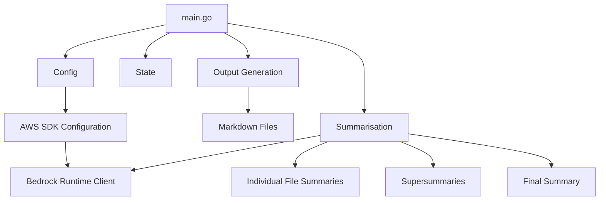

# File: main.go

## Summary:

This code is a Go program that summarises the contents of a directory and its subdirectories, generating summaries for each file and combining them into a final summary. The main features and components of the code are:

1. **Project Structure**: The code operates within a directory structure that includes a configuration file, a state file, and output directories for storing the generated summaries.

2. **Configuration**: The program reads a configuration file (in JSON format) that specifies various settings, such as the AWS region, file extensions to process, prompts for the summarisation, and limits on the summarisation process.

3. **State Management**: The program maintains a state file that keeps track of the files that have already been processed, allowing the summarisation process to be resumed from the last checkpoint.

4. **File Processing**: The code identifies the files to be processed based on the configured file extensions and ignores paths specified in the configuration. It then processes the files in batches, summarising each file using the Anthropic Bedrock Runtime API and saving the results to Markdown files.

5. **Summarisation**: The code uses the Anthropic Bedrock Runtime API to generate summaries for individual files, as well as a "supersummary" that combines the summaries of multiple files, and a final summary that synthesises all the supersummaries.

6. **Output Generation**: The generated summaries are saved to Markdown files in the output directory, with separate files for the individual file summaries, the supersummaries, and the final summary.

7. **Parallelism**: The code uses goroutines to process the files in parallel, improving the overall performance of the summarisation process.

8. **Error Handling**: The code includes error handling to gracefully handle issues that may arise during the summarisation process, such as failed API calls or file I/O errors.

Overall, this code provides a comprehensive solution for summarising the contents of a directory and its subdirectories, with features for managing the summarisation process, generating various levels of summaries, and saving the results in a structured format.

Here's a basic text-based diagram (using MermaidJS syntax) to illustrate the main components and their relationships:

---
