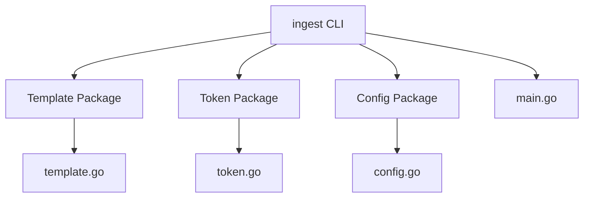

# Supersummary

Based on the provided file summaries, the Ollama project appears to be a command-line tool called "ingest" that is designed to generate Markdown-formatted prompts from files and directories. The project consists of the following main components:

1. **Template Package**: The `template` package handles the setup, reading, and rendering of templates for the `ingest` application. It provides functions to set up templates, read template files, and render templates with data.

2. **Token Package**: The `token` package provides functionality for working with text tokenization. It includes functions to get a tokenizer instance, get information about the associated model, and count the number of tokens in a given text.

3. **Config Package**: The `config` package defines the configuration structure and functionality for the Ollama project. It includes structs for LLM (Large Language Model) configuration and the overall project configuration, as well as functions to load, create, and manage the configuration.

4. **Main Application**: The `main.go` file is the entry point of the "ingest" command-line tool. It sets up the Cobra command-line interface, processes the provided paths, generates a tree-like representation of the source code, handles git operations, renders the output using templates, and optionally sends the generated prompt to an LLM API for inference. It also includes functionality for automatically saving the output, estimating vRAM requirements, and generating shell completion scripts.

Here's a high-level diagram representing the overall structure and relationships between the main components of the project:

The `ingest` CLI application utilizes the `Template`, `Token`, and `Config` packages to perform its core functionality. The `main.go` file serves as the entry point and orchestrates the interactions between these components.

This project appears to be a comprehensive tool for generating prompts from source code, with a focus on flexibility, customization, and integration with large language models. The modular design and clear separation of concerns make the codebase easy to understand and maintain.

---

